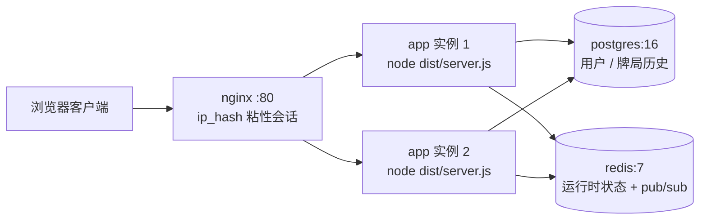

# 部署指南

多人联机德州扑克的部署文档。涵盖多实例生产拓扑、环境变量总表，以及
本地直接运行 / PM2 / Docker Compose 三种部署方式。

> 多实例能力（P5a）：配置 `REDIS_URL` 后，服务自动启用 Socket.IO
> redis-adapter（跨实例广播）与房间级 scheduler owner（回合计时器、AI
> 决策的集群仲裁），并强制要求 `STORE_BACKEND=redis`，否则启动即报错，
> 绝不静默退化为脑裂的单实例。

## 1. 多实例拓扑（Docker Compose）



- `nginx`：`deploy/nginx.conf`，对 `/socket.io` 开启 Upgrade 头转发，
  `ip_hash` 保证同一客户端的轮询握手与 WebSocket 升级落在同一实例。
- `app`：同一镜像跑 2 副本（`deploy.replicas: 2`），只暴露内部 3000 端口。
- `postgres` / `redis`：数据卷持久化 + 健康检查，`app` 依赖其健康后启动。

## 2. 环境变量总表

| 变量 | 含义 | 默认值 | 说明 |
| --- | --- | --- | --- |
| `NODE_ENV` | 运行环境 | `development` | 生产设为 `production`，影响缓存与日志格式 |
| `PORT` | HTTP 端口 | `3000` | 容器内固定 3000，由 nginx 对外映射 |
| `HOST` | 监听地址 | `0.0.0.0` | |
| `FRONTEND_DIR` | 前端静态目录 | `frontend-app/dist` | 相对进程工作目录；Vue 构建产物，需先 `npm run build:app` |
| `STORE_BACKEND` | 存储后端 | `memory` | `memory` / `postgres` / `redis`；多实例必须 `redis` |
| `DATABASE_URL` | PostgreSQL 连接串 | 空 | `STORE_BACKEND=postgres` 时必需，用户与牌局历史持久化 |
| `REDIS_URL` | Redis 连接串 | 空 | 设置即进入多实例模式（adapter + scheduler owner），且强制 `STORE_BACKEND=redis` |
| `JWT_SECRET` | JWT 签名密钥 | 空 | 生产必须显式设置强密钥，compose 中仅为占位 |
| `JWT_EXPIRES_IN` | 令牌有效期 | `7d` | jsonwebtoken 格式，如 `12h`、`3600` |
| `CORS_ORIGINS` | 跨域白名单 | 空（放开） | 逗号分隔；生产务必设置 |
| `RATE_LIMIT_WINDOW_MS` | 限流窗口 | `900000` | `/api/` 限流窗口毫秒数 |
| `RATE_LIMIT_MAX` | 限流上限 | `100` | 窗口内单 IP 最大请求数 |
| `AI_PROVIDER` | AI 服务商类型 | `openai-compatible` | |
| `AI_BASE_URL` | AI 接口地址 | OpenAI 官方 | 支持 DeepSeek、Moonshot、通义、Groq 等兼容服务 |
| `AI_API_KEY` | AI 密钥 | 空 | 只放服务器，不进 Git |
| `AI_MODEL` | AI 模型 | `gpt-4o-mini` | |
| `AI_TIMEOUT_MS` | AI 超时 | `10000` | |
| `AI_TEMPERATURE` | 采样温度 | `0.4` | 值越高输出越随机 |
| `AI_MAX_TOKENS` | 最大输出 token | `256` | 请求侧实际使用 `max(AI_MAX_TOKENS, 4096)`，低于 4096 会被提升，避免 JSON 截断 |
| `AI_FALLBACK_ENABLED` | AI 规则回退 | `true` | AI 超时/出错时回退规则引擎 |
| `NGINX_PORT` | 对外端口 | `80` | 仅 compose 使用，宿主端口映射 |
| `POSTGRES_USER` / `POSTGRES_PASSWORD` / `POSTGRES_DB` | 数据库账号 | `poker` / `poker` / `poker` | 仅 compose 使用，同时拼入 app 的 `DATABASE_URL` |

compose 会自动读取与 `docker-compose.yml` 同级的 `.env` 做变量替换，
把真实值（`JWT_SECRET`、`AI_API_KEY` 等）写在那里即可，不要提交。

## 3. 方式一：本地直接运行（无 Docker）

适合单机部署或开发自验。单实例可用 `memory` 存储；要持久化或多实例，
自行准备 PostgreSQL/Redis 并设置对应环境变量。

```bash
npm ci                 # 含 devDependencies（tsc 构建需要）
npm run build          # tsc → dist/
npm run build:app      # vite → frontend-app/dist/（默认托管目录）
npm run start:prod     # node dist/server.js
```

开发模式仍是 `npm start`（tsx 直跑 `server.ts`，免构建）。

## 4. 方式二：PM2（遗留单实例方案）

> 仅适合单实例。多实例部署请使用 Docker Compose（见下节），不要在
> PM2 cluster 模式下直接多开——跨实例广播与计时器仲裁依赖 Redis
> 接线，Compose 拓扑已把环境变量、健康检查与粘性代理全部配好。

```bash
npm ci && npm run build        # 先构建，ecosystem 指向 dist/server.js
npm install -g pm2
pm2 start ecosystem.config.js
pm2 save && pm2 startup
```

## 5. 方式三：Docker Compose（推荐，多实例）

```bash
cp .env.example .env           # 填写 JWT_SECRET / AI_API_KEY 等真实值
docker compose up -d --build   # 构建镜像并启动 nginx + app×2 + postgres + redis
docker compose ps              # 查看各服务健康状态
```

首次启动后访问 `http://localhost/`（或 `${NGINX_PORT}` 端口）。

## 6. 扩容与缩容

```bash
# 扩到 4 个 app 实例
docker compose up -d --scale app=4

# nginx 只在启动时解析一次 app 的实例 IP，扩缩容后必须重启它
docker compose restart nginx
```

无需改任何配置：新实例通过同一 `REDIS_URL` 接入广播总线与 scheduler
仲裁，房间状态在 Redis 中共享。

## 7. 健康检查

- 应用：`GET /health` 返回 `{"status":"ok", ...}`，镜像内置
  `HEALTHCHECK` 与 compose `healthcheck` 均已接入。
- 依赖：postgres 用 `pg_isready`，redis 用 `redis-cli ping`。
- 手工验证：

```bash
curl http://localhost/health          # 经 nginx
docker compose exec app wget -qO- http://localhost:3000/health
```

## 8. 日志与排障

```bash
docker compose logs -f app            # 应用日志（所有副本）
docker compose logs -f nginx          # 代理日志
```

- 启动即退出且日志含 `REDIS_URL requires STORE_BACKEND=redis`：
  环境变量组合错误，多实例模式强制 redis 存储。
- 启动即退出且日志含 `Redis is unreachable`：Redis 未就绪或连接串错误，
  服务按设计快速失败（不静默降级为单实例）。

### 8.1 宿主端口冲突（共享服务器常见）

三个宿主端口可能与机器上已有服务冲突，全部可在 `.env` 里改，无需动代码：

| 现象（`docker compose up` 报错） | 冲突端口 | 处理 |
| --- | --- | --- |
| `bind host port 0.0.0.0:80: address already in use` | 80（nginx 对外） | `.env` 设 `NGINX_PORT=8080`，并**同步** `CORS_ORIGINS=http://<IP>:8080`（协议+IP+端口须与浏览器地址栏完全一致），云安全组放行 8080 |
| `...:5432: address already in use` | 5432（postgres 调试映射） | `.env` 设 `POSTGRES_HOST_PORT=15432`（仅宿主调试端口，app 走内部网络 `postgres:5432`，不受影响） |
| `...:6379: address already in use` | 6379（redis 调试映射） | `.env` 设 `REDIS_HOST_PORT=16379`（同上） |

排查占用者：`sudo ss -tlnp | grep ':80 '`。注意占用进程**可能不是 systemd 管的 nginx**
（`systemctl status nginx` 显示 failed，但 `ss` 里进程仍在）——那是别的服务
手动起的反代，不要贸然 kill。postgres/redis 的调试映射已绑 `127.0.0.1`，不对公网暴露。

### 8.2 nginx 反复重启：`host not found in upstream "app:3000"`

nginx 在配置加载时一次性解析 `app` 服务名，若它先于 app 容器启动就会
`[emerg]` 崩溃并被 `restart: unless-stopped` 拉起，形成循环。compose 已用
`depends_on: app: condition: service_healthy` 让 nginx 等 app 健康后再启动。
若仍遇到（例如手改了旧配置），先 `docker compose down` 清掉脏网络再
`docker compose up -d`；app 变 healthy 后 `docker compose restart nginx` 即可恢复。

## 9. 自动部署（CI/CD）

`.github/workflows/ci.yml` 在 `test` 作业（tsc + 后端测试 + 前端 Vitest + 双端
构建）全部通过后，才运行 `deploy` 作业；且仅在 **push 到 `main`** 时
触发（PR 与 fork 不部署）。deploy 通过 SSH 登录服务器，拉取最新
`main` 并 `docker compose up -d --build`（保留 postgres/redis 数据卷），
最后做一次 `/health` 冗测。

### 9.1 服务器侧准备（一次性）

用专用密钥而非密码登录（更安全，也是 CD 前提）：

```bash
# 在本机生成一对部署专用密钥（不要用个人日常密钥）
ssh-keygen -t ed25519 -C "texas-poker-cd" -f deploy_key

# 把公钥加到服务器（在服务器上执行，或用 ssh-copy-id）
cat deploy_key.pub >> ~/.ssh/authorized_keys

# 确保服务器上仓库已克隆且 .env 已配好（第 5 节）
cd ~/texas-poker && git remote -v
```

### 9.2 GitHub Secrets

仓库 **Settings → Secrets and variables → Actions** 配置：

| Secret | 必填 | 说明 |
| --- | --- | --- |
| `DEPLOY_HOST` | ✓ | 服务器 IP（如 `113.46.215.121`） |
| `DEPLOY_USER` | ✓ | SSH 用户（如 `root`） |
| `DEPLOY_SSH_KEY` | ✓ | 上面 `deploy_key` 私钥的**完整内容**（含首尾 BEGIN/END 行） |
| `DEPLOY_PORT` | ✗ | SSH 端口，缺省 22 |
| `DEPLOY_PATH` | ✗ | 仓库路径，缺省 `~/texas-poker` |

建议同时在 **Settings → Environments** 新建 `production` 环境（工作流已引用），
如需部署前人工审批，在该环境加 required reviewers 即可。

### 9.3 触发与回滚

- 触发：合并 PR 到 `main`（或直推 `main`）→ CI 绿 → 自动部署。
- 回滚：`git revert` 后推 `main`，重跑一次部署；或在服务器
  `git reset --hard <旧 commit> && docker compose up -d --build`。
- 部署脚本用 `git reset --hard origin/main`，因此**不要在服务器仓库
  里手改受控文件**（会被覆盖）；`.env` 不受控，安全。

## 10. 注意事项

- 生产环境务必设置 `JWT_SECRET` 与 `CORS_ORIGINS`。
- `AI_API_KEY` 只保存在服务器 `.env` 中，不要提交到 Git。
- 单实例 `memory` 存储重启即丢房间与玩家数据；持久化至少使用
  `STORE_BACKEND=postgres`，多实例使用 `redis`。
