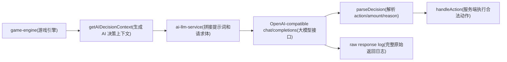
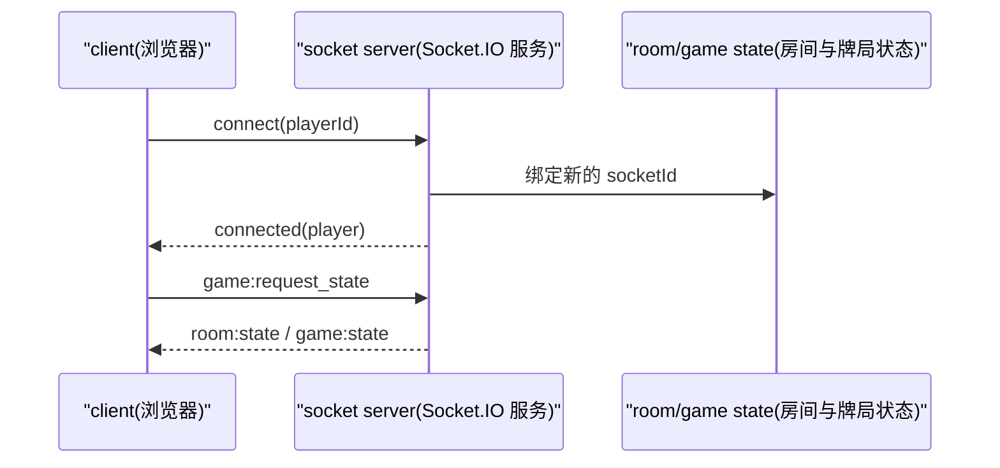

# Texas Hold'em Poker

一款基于浏览器的多人联机德州扑克游戏。打开网页即可快速开局，支持创建/加入房间、AI 机器人补位、完整德州扑克规则与实时 WebSocket 对战。

---

## 特性

- **即开即玩**：无需安装客户端，浏览器访问即可游戏；支持游客模式。
- **实时联机**：基于 Socket.IO 实现低延迟双向通信，支持断线重连与重连后的状态恢复。
- **房间系统**：创建公开/私密房间，配置人数、盲注、初始筹码与是否允许 AI。
- **AI 陪玩**：接入 OpenAI-compatible 大模型（DeepSeek / Moonshot / 通义千问 / Groq 等），支持思考模式、中文决策理由、完整原始响应日志，未配置 key 时自动降级为规则型 AI。
- **配置驱动**：AI key、模型、base URL、CORS、限流等全部通过 `.env` 配置。
- **生产就绪**：内置 helmet、cors、限流、健康检查、优雅关闭、Docker / PM2 部署配置。
- **标准规则**：完整四轮下注（Pre-flop / Flop / Turn / River）、摊牌比大小、主池与边池计算。
- **服务端权威**：所有游戏逻辑在服务端执行，客户端仅做展示，防止作弊。
- **模块化架构**：领域层、服务层、存储层、路由与 Socket 事件分层清晰，便于扩展。

---

## 技术栈

| 层级 | 技术 |
|------|------|
| 后端运行时 | Node.js 18+ |
| Web 框架 | Express 4.x |
| 实时通信 | Socket.IO 4.x |
| 前端 | 原生 HTML5 + CSS3 + ES6（零构建依赖） |
| 存储 | 内存 Map（MVP 阶段，可替换为 Redis/PostgreSQL） |
| 配置 | `.env` 环境变量 |
| 部署 | Docker / docker-compose / PM2 |
| 测试 | Node.js 内置 test runner |

---

## 快速开始

### 环境要求

- Node.js >= 18.0.0
- npm

### 安装与启动

```bash
# 克隆项目后进入目录
npm install

# 复制环境变量示例并编辑
cp .env.example .env
# 编辑 .env，填写 AI_API_KEY 等配置

# 启动服务
npm start
```

服务默认监听 `http://localhost:3000`，用浏览器打开该地址即可进入游戏大厅。

### 运行测试

```bash
# 运行所有测试
npm test

# 单独运行牌型评估或底池测试
npm run test:hand
npm run test:pot
```

---

## 环境变量配置

复制 `.env.example` 为 `.env` 后按需修改。AI 未配置有效 `AI_API_KEY(大模型 API Key)` 时，系统会自动使用规则型 AI。

| 变量 | 含义 | 默认/示例 | 说明 |
|------|------|----------|------|
| `NODE_ENV(运行环境)` | 当前运行环境 | `development` | 影响部分中间件行为。 |
| `PORT(服务端口)` | HTTP 与 Socket.IO 监听端口 | `3000` | 默认访问 `http://localhost:3000`。 |
| `HOST(监听地址)` | 服务绑定地址 | `0.0.0.0` | 本机开发也可改为 `127.0.0.1`。 |
| `AI_PROVIDER(AI 提供商标识)` | 日志中展示的 AI 提供商 | `openai-compatible` | 用于区分 DeepSeek、OpenAI 兼容网关等。 |
| `AI_BASE_URL(大模型接口地址)` | Chat Completions 基础地址 | `https://api.openai.com/v1` | 会请求 `${AI_BASE_URL}/chat/completions`。 |
| `AI_API_KEY(大模型 API Key)` | 调用大模型的密钥 | `sk-your-api-key-here` | 无有效 key 时降级为规则型 AI。 |
| `AI_MODEL(大模型名称)` | 实际调用的模型 | `gpt-4o-mini` | 可配置为兼容接口支持的模型名。 |
| `AI_TIMEOUT_MS(大模型请求超时)` | 单次 LLM 请求超时时间 | `10000` | 当前为 10 秒，超时后会按失败处理并进入重试/弃牌保护。 |
| `AI_TEMPERATURE(采样温度)` | 决策随机性 | `0.4` | 值越高，输出越随机。 |
| `AI_MAX_TOKENS(最大输出 token)` | 期望的最大输出长度 | `4096` | 实际请求使用 `max(AI_MAX_TOKENS, 4096)`，低于 4096 会被提升到 4096，避免 JSON 被截断。 |
| `AI_FALLBACK_ENABLED(AI 降级开关)` | LLM 不可用时是否使用规则 AI | `true` | 关闭后 LLM 失败会直接走弃牌保护。 |
| `CORS_ORIGINS(跨域白名单)` | 允许访问的前端源 | 空 | 多个源用英文逗号分隔；开发为空表示放开。 |
| `RATE_LIMIT_WINDOW_MS(限流窗口)` | 限流时间窗口 | `900000` | 单位毫秒。 |
| `RATE_LIMIT_MAX(限流次数)` | 每个窗口内最大请求数 | `100` | 主要保护 REST API。 |

---

## 项目结构

```
texas-poker/
├── server.js                    # 入口：Express + Socket.IO 启动
├── package.json
├── README.md                    # 本文件
├── DEPLOY.md                    # 线上部署指南
├── .env.example                 # 环境变量示例
├── Dockerfile                   # Docker 镜像
├── docker-compose.yml           # Docker Compose 配置
├── ecosystem.config.js          # PM2 配置
├── ARCHITECTURE.md              # 系统架构文档
├── PRD.md                       # 产品需求文档
├── TASKS.md                     # 开发任务列表
│
├── backend/
│   ├── config/constants.js      # 游戏常量（盲注、超时、AI 名称等）
│   ├── domain/                  # 领域逻辑层（纯函数、可独立测试）
│   ├── storage/                 # 数据存储实现
│   │   └── memory-store.js      # 内存 Map 存储（MVP 阶段）
│   ├── services/                # 服务层（有状态、管理生命周期）
│   │   ├── player-manager.js    # 玩家/游客管理
│   │   ├── room-manager.js      # 房间生命周期
│   │   ├── game-engine.js       # 游戏状态机与核心逻辑
│   │   ├── ai-manager.js        # AI 机器人创建与决策（LLM + 规则降级）
│   │   └── ai-llm-service.js    # 大模型 AI 调用服务
│   ├── routes/                  # REST API
│   │   ├── auth.js              # /api/auth/*
│   │   └── rooms.js             # /api/rooms/*
│   └── socket/                  # WebSocket 事件处理
│       ├── handlers.js          # Socket.IO 初始化与连接管理
│       └── events.js            # 房间与游戏事件处理
│
└── frontend/                    # 前端单页应用
    ├── index.html
    ├── css/
    │   ├── base.css             # 基础样式与变量
    │   ├── lobby.css            # 大厅样式
    │   ├── room.css             # 房间样式
    │   └── table.css            # 牌桌样式
    └── js/
        ├── app.js               # 入口、路由、初始化
        ├── api.js               # HTTP API 封装
        ├── socket-client.js     # Socket.IO 客户端
        ├── views/               # 页面视图
        │   ├── lobby.js
        │   ├── room.js
        │   └── table.js
        └── components/          # UI 组件
            ├── card.js
            ├── seat.js
            ├── chips.js
            ├── pot.js
            ├── timer.js
            └── actions.js
```

---

## AI 决策与日志

AI 行动由服务端统一触发。前端只展示结果，不能直接决定 AI 动作。



### 每次发送给 AI 的内容

请求体固定包含两条消息：

- `system message(系统提示词)`：要求模型扮演德州扑克玩家，只返回一个压缩 JSON 对象，并且 `reason(理由)` 必须为中文。
- `user message(用户提示词)`：当前 AI 玩家视角下的牌局状态。

`user message(用户提示词)` 会包含：

- `Current round(当前阶段)`：`preflop` / `flop` / `turn` / `river`
- `Community cards(公共牌)`：当前桌面公共牌
- `Your seat(自己的座位号)`
- `Your hole cards(自己的底牌)`：只包含当前 AI 自己的底牌
- `Your chips(自己的剩余筹码)`
- `Your current bet this round(自己本轮已下注)`
- `Current table bet to call(当前桌面最高下注)`
- `Amount you need to call(需要跟注金额)`
- `Minimum raise total(最小加注到的总额)`
- `Total pot(底池总额)`
- `Players still in hand(还未弃牌的玩家数)`
- `Your style(AI 风格)`：`tight` / `loose` / `balanced`
- `legal_actions(合法动作)`：允许动作、跟注额、最小加注、最大加注
- `action_history(动作历史)`：各下注轮内的座位、玩家名、动作、金额、动作后底池
- `position_context(位置上下文)`：庄位、小盲、大盲、行动顺序、自己后面还有几人行动
- `pot_odds(底池赔率)`：底池大小、跟注额、赔率、有效筹码、SPR

AI 不会直接收到完整未脱敏的 `players(玩家列表)`，也不会在普通行动中看到其他玩家底牌。只有在牌局已结束或所有未弃牌玩家都 all-in 时，服务端才会公开可展示的底牌信息。

### 大模型请求参数

当前请求体会发送：

```json
{
  "response_format": { "type": "json_object" },
  "thinking": { "type": "enabled" },
  "stream": false
}
```

同时使用 `.env` 中的 `AI_MODEL(大模型名称)`、`AI_TEMPERATURE(采样温度)`、`AI_TIMEOUT_MS(大模型请求超时)` 和 `AI_MAX_TOKENS(最大输出 token)`。

当前不会发送思考强度控制参数：

```json
{
  "reasoning_effort": "max",
  "output_config": { "effort": "max" }
}
```

### 返回格式与失败保护

模型必须返回：

```json
{"action":"call","amount":0,"reason":"底池赔率合适，可以跟注"}
```

- `action(动作)`：只能是 `fold`、`check`、`call`、`raise`、`allin` 之一。
- `amount(下注金额)`：`raise` 时表示本轮要加注到的总额，其他动作填 `0`。
- `reason(理由)`：必须是简短中文字符串。

如果模型返回空内容、非法 JSON、非法动作或不合法的加注金额，服务端会最多重试 2 次；仍失败时，为避免卡住牌局，该 AI 会自动弃牌。

### 后端日志

每次 LLM 返回都会完整打印原始内容，格式类似：

```text
[2026-07-02T06:42:31.944Z] [AI-LLM] Raw response for Bot-Nu (openai-compatible/deepseek-v4-flash) finish_reason=stop: {"action":"check","amount":0,"reason":"弱牌且无需跟注，选择过牌"}
```

日志字段说明：

- `timestamp(时间戳)`：ISO 时间，便于按时间排查。
- `Bot-Nu(AI 玩家名称)`：房间内唯一，避免多个 AI 重名。
- `provider/model(提供商和模型)`：例如 `openai-compatible/deepseek-v4-flash`。
- `finish_reason(结束原因)`：模型结束原因，例如 `stop`、`length`。
- `raw content(原始内容)`：模型返回的完整正文，不做截断。

---

## 接口概览

### REST API

| 方法 | 路径 | 说明 |
|------|------|------|
| POST | `/api/auth/guest` | 创建游客 |
| POST | `/api/auth/register` | 注册（MVP 后完善） |
| POST | `/api/auth/login` | 登录（MVP 后完善） |
| GET  | `/api/rooms` | 公开房间列表 |
| POST | `/api/rooms` | 创建房间 |
| GET  | `/api/rooms/:id` | 房间详情 |
| POST | `/api/rooms/:id/join` | 加入房间 |

### WebSocket 事件（客户端 → 服务端）

| 事件 | 说明 |
|------|------|
| `room:join` | 加入房间 |
| `room:leave` | 离开房间 |
| `room:ready` | 准备/取消准备 |
| `room:start` | 房主开始游戏 |
| `seat:sit` | 入座 |
| `seat:stand` | 离座 |
| `game:action` | 执行游戏动作（Fold/Check/Call/Bet/Raise/All-in） |
| `chat:message` | 发送聊天消息 |

### WebSocket 事件（服务端 → 客户端）

| 事件 | 说明 |
|------|------|
| `room:state` | 房间状态更新 |
| `player:joined` / `player:left` / `player:ready` | 玩家状态变化 |
| `game:started` | 游戏开始 |
| `game:dealt` | 发放底牌（仅本人可见） |
| `game:community` | 发放公共牌 |
| `game:turn` | 轮到某位玩家行动 |
| `game:action` | 玩家动作通知 |
| `game:pot` | 底池更新 |
| `game:showdown` | 摊牌结果 |
| `game:ended` | 牌局结束与结算 |
| `chat:message` | 聊天消息 |
| `error` | 错误通知 |

---

## 断线重连

前端 Socket.IO 客户端默认开启自动重连：

- `reconnection(自动重连)`：`true`
- `reconnectionAttempts(最大重试次数)`：`5`
- `reconnectionDelay(首次重试延迟)`：`1000ms`
- `reconnectionDelayMax(最大重试延迟)`：`5000ms`
- `transports(传输方式)`：优先 `websocket`，可回退到 `polling`

重连流程：



服务端会为断线玩家保留 `DISCONNECT_TIMEOUT_MS(断线保留窗口)`，当前为 `60000ms`。玩家在窗口内重连时，会用新的 `socketId(Socket 连接 ID)` 重新绑定原来的 `playerId(玩家 ID)`，并请求完整状态恢复。超过窗口仍未上线时，服务端才会按离开房间处理。

注意：当前 MVP 使用内存存储，服务进程重启会清空房间、玩家和牌局状态；断线重连只覆盖服务进程仍在运行的情况。

---

## 游戏规则摘要

1. **座位**：每桌 2–9 人，支持 AI 补位。
2. **盲注**：庄家（Dealer）左侧第一位下小盲注，第二位下大盲注。
3. **发牌**：每位玩家获得 2 张底牌，桌面发出 5 张公共牌。
4. **下注轮**：Pre-flop → Flop → Turn → River。
5. **行动**：Fold（弃牌）/ Check（过牌）/ Call（跟注）/ Bet（下注）/ Raise（加注）/ All-in（全押）。
6. **比牌**：从 7 张牌中选最优 5 张，按牌型大小决定胜负。
7. **底池**：支持主池与多层边池，All-in 玩家只能赢得自己参与的主池/边池。

牌型从大到小：皇家同花顺 > 同花顺 > 四条 > 葫芦 > 同花 > 顺子 > 三条 > 两对 > 一对 > 高牌。

---

## 开发与测试

```bash
# 开发模式启动
node server.js

# 运行核心逻辑测试
npm test
```

核心领域逻辑（`backend/domain/`）已覆盖：Card、Deck、牌型评估与底池计算。

---

## 当前阶段

本项目处于 **MVP 阶段**，已实现：

- 游客模式与基础玩家管理
- 房间创建、加入、入座、准备、开始
- 完整德州扑克游戏流程
- AI 机器人补位与决策
- 实时 WebSocket 状态同步

后续计划：注册用户/登录、历史记录、聊天、排行榜、移动端适配、锦标赛模式等。

---

## 许可证

MIT
