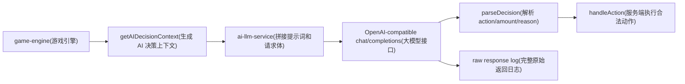
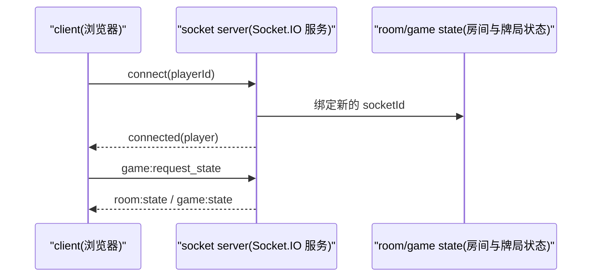

# Texas Hold'em Poker

一款基于浏览器的多人联机德州扑克游戏。打开网页即可快速开局，支持创建/加入房间、AI 机器人补位、完整德州扑克规则与实时 WebSocket 对战。

---

## 特性

- **即开即玩**：无需安装客户端，浏览器访问即可游戏；支持游客模式。
- **实时联机**：基于 Socket.IO 实现低延迟双向通信，支持断线重连与重连后的状态恢复。
- **房间系统**：创建公开/私密房间，配置人数、盲注、初始筹码与是否允许 AI。
- **AI 陪玩**：接入 OpenAI-compatible 大模型（DeepSeek / Moonshot / 通义千问 / Groq 等），支持思考模式、中文决策理由、完整原始响应日志，未配置 key 时自动降级为规则型 AI。
- **配置驱动**：AI key、模型、base URL、CORS、限流等全部通过 `.env` 配置。
- **生产就绪**：内置 helmet、cors、限流、健康检查、优雅关闭、Docker / PM2 部署配置。
- **标准规则**：完整四轮下注（Pre-flop / Flop / Turn / River）、摊牌比大小、主池与边池计算。
- **服务端权威**：所有游戏逻辑在服务端执行，客户端仅做展示，防止作弊。
- **模块化架构**：领域层、服务层、存储层、路由与 Socket 事件分层清晰，便于扩展。

---

## 技术栈

| 层级 | 技术 |
|------|------|
| 后端运行时 | Node.js 22+（TypeScript，开发用 tsx 直跑，生产 tsc 构建到 `dist/`） |
| Web 框架 | Express 4.x |
| 实时通信 | Socket.IO 4.x（多实例时接 `@socket.io/redis-adapter`） |
| 认证 | JWT（jsonwebtoken）+ bcryptjs；游客与注册用户统一签发 token |
| 前端 | Vue 3 + TypeScript + Vite + Pinia + Vue Router + Vant + GSAP（`frontend-app/`）；旧版原生页面保留在 `frontend/` 作回退 |
| 存储 | 内存 Map（默认）/ PostgreSQL（用户+历史）/ Redis（运行时状态），由 `STORE_BACKEND(存储后端)` 选择 |
| 配置 | `.env` 环境变量 |
| 部署 | Docker Compose（nginx + app×2 + postgres + redis，推荐）/ PM2（遗留单实例）；详见 `DEPLOY.md` |
| 测试 | 后端 Node.js 内置 test runner；前端 Vitest + @vue/test-utils |

---

## 快速开始

### 环境要求

- Node.js >= 22.0.0
- npm

### 安装与启动

```bash
# 克隆项目后进入目录
npm install

# 复制环境变量示例并编辑
cp .env.example .env
# 编辑 .env，填写 AI_API_KEY 等配置

# 启动后端服务（tsx 直跑 server.ts）
npm start

# 另开终端：启动 Vue 前端开发服务（Vite，代理 /api 与 /socket.io 到 3000）
npm run dev:app
```

后端默认监听 `http://localhost:3000`（直接打开可访问旧版静态前端）；开发时推荐访问 Vite 开发服务地址（默认 `http://localhost:5173`）使用 Vue 新前端。生产环境用 `FRONTEND_DIR=frontend-app/dist` 托管构建产物。

### 运行测试

```bash
# 后端全量测试（node:test + tsx）
npm test

# 单独运行牌型评估或底池测试
npm run test:hand
npm run test:pot

# 前端单元测试（Vitest）
npm run test:app
```

---

## 环境变量配置

复制 `.env.example` 为 `.env` 后按需修改。AI 未配置有效 `AI_API_KEY(大模型 API Key)` 时，系统会自动使用规则型 AI。

| 变量 | 含义 | 默认/示例 | 说明 |
|------|------|----------|------|
| `NODE_ENV(运行环境)` | 当前运行环境 | `development` | 影响部分中间件行为。 |
| `PORT(服务端口)` | HTTP 与 Socket.IO 监听端口 | `3000` | 默认访问 `http://localhost:3000`。 |
| `HOST(监听地址)` | 服务绑定地址 | `0.0.0.0` | 本机开发也可改为 `127.0.0.1`。 |
| `AI_PROVIDER(AI 提供商标识)` | 日志中展示的 AI 提供商 | `openai-compatible` | 用于区分 DeepSeek、OpenAI 兼容网关等。 |
| `AI_BASE_URL(大模型接口地址)` | Chat Completions 基础地址 | `https://api.openai.com/v1` | 会请求 `${AI_BASE_URL}/chat/completions`。 |
| `AI_API_KEY(大模型 API Key)` | 调用大模型的密钥 | `sk-your-api-key-here` | 无有效 key 时降级为规则型 AI。 |
| `AI_MODEL(大模型名称)` | 实际调用的模型 | `gpt-4o-mini` | 可配置为兼容接口支持的模型名。 |
| `AI_TIMEOUT_MS(大模型请求超时)` | 单次 LLM 请求超时时间 | `10000` | 当前为 10 秒，超时后会按失败处理并进入重试/弃牌保护。 |
| `AI_TEMPERATURE(采样温度)` | 决策随机性 | `0.4` | 值越高，输出越随机。 |
| `AI_MAX_TOKENS(最大输出 token)` | 期望的最大输出长度 | `4096` | 实际请求使用 `max(AI_MAX_TOKENS, 4096)`，低于 4096 会被提升到 4096，避免 JSON 被截断。 |
| `AI_FALLBACK_ENABLED(AI 降级开关)` | LLM 不可用时是否使用规则 AI | `true` | 关闭后 LLM 失败会直接走弃牌保护。 |
| `CORS_ORIGINS(跨域白名单)` | 允许访问的前端源 | 空 | 多个源用英文逗号分隔；开发为空表示放开。 |
| `RATE_LIMIT_WINDOW_MS(限流窗口)` | 限流时间窗口 | `900000` | 单位毫秒。 |
| `RATE_LIMIT_MAX(限流次数)` | 每个窗口内最大请求数 | `100` | 主要保护 REST API。 |
| `STORE_BACKEND(存储后端)` | 运行时存储实现 | `memory` | `memory`（默认，无外部依赖）/ `postgres`（用户与历史入 PostgreSQL，运行时状态仍在内存）/ `redis`（players/rooms/games 入 Redis）。 |
| `DATABASE_URL(数据库连接)` | PostgreSQL 连接串 | 空 | `STORE_BACKEND=postgres` 时必填。 |
| `REDIS_URL(Redis 连接)` | Redis 连接串 | 空 | `STORE_BACKEND=redis` 时必填；设置后同时启用多实例模式（见下节），此时必须 `STORE_BACKEND=redis`，否则启动直接失败。 |

---

## 多实例与存储后端

默认 `STORE_BACKEND=memory` 为单实例模式，行为与早期版本完全一致。设置 `REDIS_URL(Redis 连接)` 后服务器进入多实例模式：

- **广播同步**：Socket.IO 装配 `@socket.io/redis-adapter`，房间广播跨实例触达所有客户端。
- **调度归属**：每个房间的回合计时器（30s 超时弃牌）与 AI 决策调度由抢到 Redis 锁（`poker:lock:room:{roomId}`，30s TTL，Lua 原子抢锁/续锁）的实例独占；其他实例通过 `poker:sched` 信号频道通知 owner 调度。owner 宕机后锁到期，下一个调度点由存活实例接管，回合超时按"当前时间 + 完整时长"重建（即剩余倒计时重置，已接受的简化语义）。断线保留计时器（60s）始终归连接所在实例，无需共享。
- **故障语义**：Redis 不可达时启动直接失败（fail-fast，拒绝静默退化为脑裂单实例）；运行期 Redis 中断则无限退避重连，恢复后自动自愈。

**当前边界（如实说明）**：

1. **AI 回合活性缺口**：owner 宕机且当前行动方为 AI（或玩家长期不行动）时，房间可能停滞到下一个调度点才有实例接管；周期巡检接管属后续任务。
2. **跨实例动作互斥未覆盖**：游戏动作的读-改-写目前只保证进程内串行（每房间 actionQueue），跨实例并发冲突以 last-write-wins 收敛，极端边界（超时与动作同毫秒）可能出现重复事件广播。因此多实例部署依赖 nginx `ip_hash` 粘性会话，同一客户端始终落在同一实例。

> 房间/玩家生命周期的 redis 写透已完成（P5c）：`room-manager` 与 `game-engine` 的每个变更路径都会显式写回存储，`backend/storage/redis-room-flow.test.ts` 用 JSON 往返式假 Redis 验证了完整大厅链路与整手牌局。

---

## 项目结构

```
texas-poker/
├── server.ts                    # 入口：Express + Socket.IO 启动、redis-adapter/scheduler 接线
├── package.json                 # 后端脚本（start/build/test）与前端代理脚本（dev:app 等）
├── tsconfig.json                # 后端 TypeScript 配置（strict、commonjs、outDir dist）
├── README.md                    # 本文件
├── DEPLOY.md                    # 线上部署指南（多实例拓扑）
├── .env.example                 # 环境变量示例
├── Dockerfile                   # 多阶段镜像（前端构建 + 后端 tsc + 运行时）
├── docker-compose.yml           # 生产拓扑：nginx + app×2 + postgres + redis
├── deploy/nginx.conf            # 粘性反代（ip_hash + WebSocket 升级）
├── ecosystem.config.js          # PM2 配置（遗留单实例方案）
├── .github/workflows/ci.yml     # CI：tsc + 后端测试（pg/redis services）+ Vitest + 构建
├── ARCHITECTURE.md              # 系统架构文档
├── PRD.md                       # 产品需求文档
├── TASKS.md                     # 开发任务列表
│
├── backend/                     # 后端（TypeScript，CommonJS 语义）
│   ├── config/
│   │   ├── constants.ts         # 游戏常量与环境变量（冻结对象）
│   │   └── security.ts          # helmet/CSP 等安全配置
│   ├── domain/                  # 领域层：纯函数（card/deck/hand-evaluator/pot-manager）
│   ├── storage/                 # 存储层（接口全 async）
│   │   ├── index.ts             # 存储工厂：按 STORE_BACKEND 装配
│   │   ├── memory-store.ts      # 内存 Map 实现（默认）+ Storage 接口定义
│   │   ├── postgres-store.ts    # 用户/牌局历史（pg，手写 SQL）
│   │   ├── redis-store.ts       # players/rooms/games 运行时状态（ioredis）
│   │   ├── game-serializer.ts   # 牌局实体 JSON 序列化/复活（Deck/PotManager）
│   │   └── migrations/          # SQL 迁移脚本
│   ├── services/                # 服务层：player/room/game-engine/action-queue/ai-*
│   ├── routes/                  # REST API：auth（JWT 注册/登录/游客）/ rooms
│   └── socket/                  # Socket.IO：handlers / events / scheduler-owner（多实例仲裁）
│
├── frontend-app/                # Vue 3 新前端（Vite + Pinia + Vant + GSAP）
│   ├── src/
│   │   ├── views/               # Lobby / Room / Table 三大视图
│   │   ├── components/          # lobby / room / table 组件
│   │   ├── stores/              # Pinia：player / lobby / room / game
│   │   ├── services/            # api.ts / socket.ts（自动重连+状态拉取）
│   │   ├── animations/          # GSAP 动画（发牌/筹码/回合/摊牌，三档降级）
│   │   ├── types/               # 与后端事件/负载对齐的类型
│   │   └── assets/cards/        # SVG 牌面（vector-playing-cards）
│   └── vite.config.ts
│
└── frontend/                    # 旧版原生前端（回退用，验收后可归档）
```

---

## AI 决策与日志

AI 行动由服务端统一触发。前端只展示结果，不能直接决定 AI 动作。


```mermaid
flowchart LR
  A["game-engine(游戏引擎)"] --> B["getAIDecisionContext(生成 AI 决策上下文)"]
  B --> C["ai-llm-service(拼接提示词和请求体)"]
  C --> D["OpenAI-compatible chat/completions(大模型接口)"]
  D --> E["parseDecision(解析 action/amount/reason)"]
  E --> F["handleAction(服务端执行合法动作)"]
  D --> G["raw response log(完整原始返回日志)"]
```

### 每次发送给 AI 的内容

请求体固定包含两条消息：

- `system message(系统提示词)`：要求模型扮演德州扑克玩家，只返回一个压缩 JSON 对象，并且 `reason(理由)` 必须为中文。
- `user message(用户提示词)`：当前 AI 玩家视角下的牌局状态。

`user message(用户提示词)` 会包含：

- `Current round(当前阶段)`：`preflop` / `flop` / `turn` / `river`
- `Community cards(公共牌)`：当前桌面公共牌
- `Your seat(自己的座位号)`
- `Your hole cards(自己的底牌)`：只包含当前 AI 自己的底牌
- `Your chips(自己的剩余筹码)`
- `Your current bet this round(自己本轮已下注)`
- `Current table bet to call(当前桌面最高下注)`
- `Amount you need to call(需要跟注金额)`
- `Minimum raise total(最小加注到的总额)`
- `Total pot(底池总额)`
- `Players still in hand(还未弃牌的玩家数)`
- `Your style(AI 风格)`：`tight` / `loose` / `balanced`
- `legal_actions(合法动作)`：允许动作、跟注额、最小加注、最大加注
- `action_history(动作历史)`：各下注轮内的座位、玩家名、动作、金额、动作后底池
- `position_context(位置上下文)`：庄位、小盲、大盲、行动顺序、自己后面还有几人行动
- `pot_odds(底池赔率)`：底池大小、跟注额、赔率、有效筹码、SPR

AI 不会直接收到完整未脱敏的 `players(玩家列表)`，也不会在普通行动中看到其他玩家底牌。只有在牌局已结束或所有未弃牌玩家都 all-in 时，服务端才会公开可展示的底牌信息。

### 大模型请求参数

当前请求体会发送：

```json
{
  "response_format": { "type": "json_object" },
  "thinking": { "type": "enabled" },
  "stream": false
}
```

同时使用 `.env` 中的 `AI_MODEL(大模型名称)`、`AI_TEMPERATURE(采样温度)`、`AI_TIMEOUT_MS(大模型请求超时)` 和 `AI_MAX_TOKENS(最大输出 token)`。

当前不会发送思考强度控制参数：

```json
{
  "reasoning_effort": "max",
  "output_config": { "effort": "max" }
}
```

### 返回格式与失败保护

模型必须返回：

```json
{"action":"call","amount":0,"reason":"底池赔率合适，可以跟注"}
```

- `action(动作)`：只能是 `fold`、`check`、`call`、`raise`、`allin` 之一。
- `amount(下注金额)`：`raise` 时表示本轮要加注到的总额，其他动作填 `0`。
- `reason(理由)`：必须是简短中文字符串。

如果模型返回空内容、非法 JSON、非法动作或不合法的加注金额，服务端会最多重试 2 次；仍失败时，为避免卡住牌局，该 AI 会自动弃牌。

### 后端日志

每次 LLM 返回都会完整打印原始内容，格式类似：

```text
[2026-07-02T06:42:31.944Z] [AI-LLM] Raw response for Bot-Nu (openai-compatible/deepseek-v4-flash) finish_reason=stop: {"action":"check","amount":0,"reason":"弱牌且无需跟注，选择过牌"}
```

日志字段说明：

- `timestamp(时间戳)`：ISO 时间，便于按时间排查。
- `Bot-Nu(AI 玩家名称)`：房间内唯一，避免多个 AI 重名。
- `provider/model(提供商和模型)`：例如 `openai-compatible/deepseek-v4-flash`。
- `finish_reason(结束原因)`：模型结束原因，例如 `stop`、`length`。
- `raw content(原始内容)`：模型返回的完整正文，不做截断。

---

## 接口概览

### REST API

认证：`POST /api/auth/guest` 与 register/login 均返回 JWT；后续请求以 `Authorization: Bearer <token>` 携带（兼容期仍支持 `x-player-id` 头）。

| 方法 | 路径 | 说明 |
|------|------|------|
| POST | `/api/auth/guest` | 创建游客（签发 guest JWT） |
| POST | `/api/auth/register` | 注册（用户名唯一，bcrypt 哈希，签发 user JWT） |
| POST | `/api/auth/login` | 登录（签发 user JWT） |
| GET  | `/api/rooms` | 公开房间列表 |
| POST | `/api/rooms` | 创建房间 |
| GET  | `/api/rooms/:id` | 房间详情 |
| POST | `/api/rooms/:id/join` | 加入房间 |

### WebSocket 事件（客户端 → 服务端）

| 事件 | 说明 |
|------|------|
| `room:join` | 加入房间 |
| `room:leave` | 离开房间 |
| `room:ready` | 准备/取消准备 |
| `room:start` | 房主开始游戏 |
| `seat:sit` | 入座 |
| `seat:stand` | 离座 |
| `game:action` | 执行游戏动作（Fold/Check/Call/Bet/Raise/All-in） |
| `chat:message` | 发送聊天消息 |

### WebSocket 事件（服务端 → 客户端）

| 事件 | 说明 |
|------|------|
| `room:state` | 房间状态更新 |
| `player:joined` / `player:left` / `player:ready` | 玩家状态变化 |
| `game:started` | 游戏开始 |
| `game:dealt` | 发放底牌（仅本人可见） |
| `game:community` | 发放公共牌 |
| `game:turn` | 轮到某位玩家行动 |
| `game:action` | 玩家动作通知 |
| `game:pot` | 底池更新 |
| `game:showdown` | 摊牌结果 |
| `game:ended` | 牌局结束与结算 |
| `chat:message` | 聊天消息 |
| `error` | 错误通知 |

---

## 断线重连

前端 Socket.IO 客户端默认开启自动重连：

- `reconnection(自动重连)`：`true`
- `reconnectionAttempts(最大重试次数)`：`5`
- `reconnectionDelay(首次重试延迟)`：`1000ms`
- `reconnectionDelayMax(最大重试延迟)`：`5000ms`
- `transports(传输方式)`：优先 `websocket`，可回退到 `polling`

重连流程：


```mermaid
sequenceDiagram
  participant C as "client(浏览器)"
  participant S as "socket server(Socket.IO 服务)"
  participant R as "room/game state(房间与牌局状态)"

  C->>S: connect(playerId)
  S->>R: 绑定新的 socketId
  S-->>C: connected(player)
  C->>S: game:request_state
  S-->>C: room:state / game:state
```

服务端会为断线玩家保留 `DISCONNECT_TIMEOUT_MS(断线保留窗口)`，当前为 `60000ms`。玩家在窗口内重连时，会用新的 `socketId(Socket 连接 ID)` 重新绑定原来的 `playerId(玩家 ID)`，并请求完整状态恢复。超过窗口仍未上线时，服务端才会按离开房间处理。

注意：默认 `STORE_BACKEND=memory` 时，服务进程重启会清空房间、玩家和牌局状态，断线重连只覆盖服务进程仍在运行的情况；`STORE_BACKEND=redis` 时运行时状态在 Redis 中，进程重启（Redis 未重启）后房间状态可恢复。

---

## 游戏规则摘要

1. **座位**：每桌 2–9 人，支持 AI 补位。
2. **盲注**：庄家（Dealer）左侧第一位下小盲注，第二位下大盲注。
3. **发牌**：每位玩家获得 2 张底牌，桌面发出 5 张公共牌。
4. **下注轮**：Pre-flop → Flop → Turn → River。
5. **行动**：Fold（弃牌）/ Check（过牌）/ Call（跟注）/ Bet（下注）/ Raise（加注）/ All-in（全押）。
6. **比牌**：从 7 张牌中选最优 5 张，按牌型大小决定胜负。
7. **底池**：支持主池与多层边池，All-in 玩家只能赢得自己参与的主池/边池。

牌型从大到小：皇家同花顺 > 同花顺 > 四条 > 葫芦 > 同花 > 顺子 > 三条 > 两对 > 一对 > 高牌。

---

## 开发与测试

```bash
# 后端开发模式（tsx 直跑，免构建）
npm start

# 前端开发模式（Vite HMR）
npm run dev:app

# 后端全量测试 / 前端单元测试
npm test
npm run test:app

# 生产构建：后端 tsc → dist/，前端 vite → frontend-app/dist/
npm run build
npm run build:app
```

测试与源码同目录并列：后端 `backend/**/*.test.ts`（node:test），前端 `frontend-app/src/**/*.test.ts`（Vitest）。存储契约测试（`backend/storage/storage-contract.test.ts`）在本地无 `DATABASE_URL`/`REDIS_URL` 时自动跳过 postgres/redis 实现，CI 中由 GitHub Actions services 拉起依赖全量运行。

---

## 当前阶段

项目已从 MVP 升级为完整产品架构（P1–P5 全部落地）：

- **P1**：Vue 3 + TS + Vite 新前端（赌场风 UI + GSAP 动画，手机竖屏 + 桌面宽屏）
- **P2**：后端全量 TypeScript 化（strict，CommonJS 语义保持不变）
- **P3**：JWT 认证（游客/注册用户统一 token，bcrypt 密码哈希）
- **P4**：持久化（PostgreSQL 用户+牌局历史，Redis 运行时状态，三实现同一 Storage 契约）
- **P5**：多实例部署（redis-adapter + 房间级调度仲裁 + 写透持久化 + Docker/CI/nginx 拓扑）

后续方向：排行榜、锦标赛模式、AI 回合活性巡检、跨实例动作互斥。

---

## 许可证

MIT
